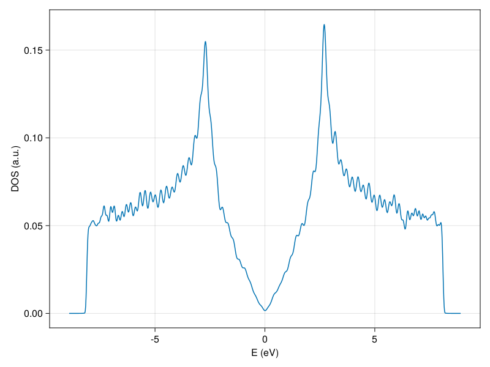
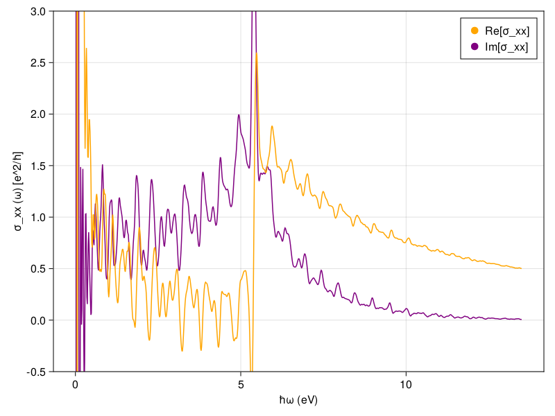

## Usage Guide: Graphene
### A. Calculate the density of states (dos) of graphene 
#### Step I. Create the Hamiltonian

```
using Quantica
using QuantiKite
h = HamiltonianPresets.graphene();
```
#### Step II. Create the configuration and settings structs

```
c = configuration(
    divisions = (1, 1),  # # partitions for the multithreaded calculation
    unitcells =(64, 64), # # repetitions of the original unitcell along the Bravais vectors
    boundaries = ("periodic", "periodic"),  
    precision = 2, # Numerical precission for the calculation
    spectrum_range = nothing # KPM bandwidth. If nothing it is computed automatically
    )

s = dos(c, num_points = 4000, num_moments = 256, num_random = 256, num_disorder = 1)
```
#### Step III. Build the h5 file
```
h5gen(h, c, s, filename = "graphenedos.h5")
```
#### Step IV. Pass the h5 file to Kite functions
Compute Chebyshev momenta in bash as
```
~/kite/build/KITEx graphenedos.h5
```
Followed by the observable reconstruction (dos) using the momenta of the Chebyshev expansion as:
```
~/kite/build/KITE-tools graphenedos.h5
```
The resulting dos is stored in a "dos.dat" file which can be plotted as:
```
dos_plot("dos.dat")
```

### B. Calculate the linear optical conductivity of graphene 
Using the same configuration struct (```c```) and Hamiltonian ```h```:
```
s = conductivity_optical(c,  num_points = 1000,  num_moments = 512,  num_random = 20,  num_disorder = 1, direction = "xx", temperature = 0.0)

h5gen(h, c, s, filename = "graphene_linear_optical_conductivity.h5")
```
Repeat step IV
```
linear_optical_conductivity_plot("hdf5/optcond.dat")
```



